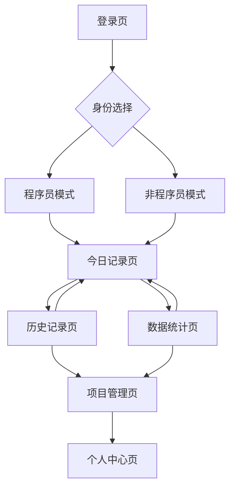

## 1. Product Overview
工作记录统计器是一款专为职场人士设计的网页端工作记录与统计应用。帮助用户轻松记录每日工作情况，自动生成日报、月报、年报，并通过AI智能分析工作数据。
- 解决上班族每日汇报、月度总结的工作痛点，提供零门槛的记录体验
- 目标用户：需要定期汇报工作的职场人士，特别是程序员和非程序员群体
- 市场价值：提升工作效率，简化汇报流程，打造个人工作数据档案

## 2. Core Features

### 2.1 User Roles
| Role | Registration Method | Core Permissions |
|------|---------------------|------------------|
| 游客用户 | 无需注册，本地使用 | 基础记录功能，数据本地存储 |
| 注册用户 | 手机号/微信/Apple ID登录 | 数据云端同步，AI分析功能，历史记录查看 |
| 程序员模式 | 身份切换选择 | 项目关联commit记录，代码工作流统计 |
| 非程序员模式 | 身份切换选择 | 手动输入工作项，项目创建管理 |

### 2.2 Feature Module
工作记录统计器包含以下核心页面：
1. **登录注册页**：多方式登录、游客模式、身份选择
2. **今日记录页**：工作记录输入、项目选择、AI总结生成
3. **历史记录页**：日历视图、记录查看、编辑管理
4. **数据统计页**：可视化图表、月度年度切换、工作趋势分析
5. **项目管理页**：项目创建编辑、commit关联、进度追踪
6. **个人中心页**：用户信息、设置偏好、数据导出

### 2.3 Page Details
| Page Name | Module Name | Feature description |
|-----------|-------------|---------------------|
| 登录注册页 | 登录模块 | 支持手机号验证码登录、微信授权、Apple ID快捷登录，提供游客模式入口 |
| 登录注册页 | 身份选择 | 胶囊按钮切换程序员/非程序员身份，影响后续界面展示 |
| 今日记录页 | 记录输入区 | 程序员模式显示项目选择和commit输入框，非程序员模式显示工作项输入框 |
| 今日记录页 | AI助手 | 点击生成AI工作总结，支持多次生成和编辑 |
| 今日记录页 | 快速预览 | 显示昨日工作情况或今日已记录内容，支持一键引用 |
| 历史记录页 | 日历组件 | 月历视图展示记录状态，支持日期切换和快速跳转 |
| 历史记录页 | 记录列表 | 按时间倒序展示工作记录，支持搜索和筛选 |
| 历史记录页 | 批量操作 | 支持多选记录进行导出、删除、标记完成等操作 |
| 数据统计页 | 图表展示 | 柱状图显示月度工作量，折线图展示工作趋势，饼图分析项目分布 |
| 数据统计页 | 时间切换 | 支持月度、年度数据切换，自定义时间范围选择 |
| 数据统计页 | AI洞察 | 基于历史数据生成工作分析报告和建议 |
| 项目管理页 | 项目列表 | 卡片式展示所有项目，显示项目进度和关联记录数 |
| 项目管理页 | 项目编辑 | 创建新项目，设置项目名称、描述、颜色标识 |
| 项目管理页 | commit关联 | 程序员模式支持关联代码仓库commit记录 |
| 个人中心页 | 用户信息 | 显示头像、昵称、身份模式，支持信息修改 |
| 个人中心页 | 数据管理 | 数据导出备份、本地数据清理、云端同步设置 |
| 个人中心页 | 偏好设置 | 界面主题选择、提醒时间设置、AI助手开关 |

## 3. Core Process
### 用户首次使用流程
用户访问应用 → 选择游客模式或注册登录 → 选择程序员/非程序员身份 → 进入今日记录页面 → 输入工作内容 → AI生成总结 → 保存记录 → 查看数据统计

### 日常记录流程
用户登录 → 进入今日记录页 → 系统自动显示昨日工作情况 → 用户输入今日工作 → 选择关联项目 → 提交记录 → 生成日报 → 数据同步

### 数据查看流程
用户进入历史记录 → 选择查看日期 → 浏览工作详情 → 编辑或补充记录 → 切换数据统计页 → 查看图表分析 → 导出报告

## 4. User Interface Design

### 4.1 核心视觉基调
- **手绘插画质感**：整体采用柔和的手绘插画风格，线条自然流畅，略带随性的笔触感，传递温暖治愈的氛围。
- **暖调森系色彩**：以低饱和度的暖色调为主，如米白、浅杏、淡木色、草绿、雾霾蓝等，搭配少量柔和的点缀色（如浅粉、鹅黄），营造自然温馨的视觉感受。
- **柔和光影与渐变**：运用细腻的色彩渐变和柔和光影，模拟自然光线的温暖感，避免生硬的色块分割，增强画面的层次感和呼吸感。

### 4.2 界面元素设计
- **图标与按钮**：图标采用手绘风格的自然元素（如树叶、花朵、小蘑菇、云朵）或生活小物（如茶杯、书本、铅笔），线条圆润可爱；按钮设计为圆角矩形或椭圆形，带有轻微的阴影或渐变，触感柔和。
- **背景与纹理**：背景可使用带有细微纹理的纸张质感（如亚麻纹、水彩纸纹）或柔和的渐变色，模拟自然材质的温暖触感，避免纯色背景的单调。
- **字体选择**：搭配圆润的手写体或无衬线字体，字号适中，行间距宽松，保证阅读舒适度的同时强化治愈感，重点文字可使用温暖的色彩突出。

### 4.3 内容与场景呈现
- **自然元素融合**：在界面中融入手绘的植物（如藤蔓、多肉、小盆栽）、阳光、云朵等自然元素，作为装饰、分隔线或背景点缀，营造森林般的清新氛围。
- **生活场景点缀**：加入手绘的温馨生活物品（如木质书架、毛毯、台灯、咖啡杯），结合记录场景（如日记、待办清单、心情打卡），体现“记录生活”的主题，增强代入感。
- **动态效果**：添加轻微的手绘风格动画，如飘落的花瓣、摇曳的树叶、闪烁的星光，或记录时的笔触动画，增加界面的生动感，但保持简洁不干扰使用。

### 4.4 交互体验设计
- **柔和反馈**：点击按钮或操作时，给予柔和的视觉反馈（如按钮轻微放大、颜色渐变）和温暖的音效（如轻柔的风铃声、翻书声），增强治愈体验。
- **简洁布局**：界面布局清晰简洁，留白适当，突出记录内容的核心区域，避免过多复杂元素，让用户专注于记录本身。
- **个性化模块**：允许用户自定义界面装饰（如选择不同的植物主题、背景纹理或色彩搭配），增加用户的参与感和归属感。

### 4.5 具体设计关键词
手绘插画风、治愈系、森系、暖色调、低饱和度、柔和光影、自然元素、生活气息、圆角设计、纸张纹理、手写体、轻微动画、温馨场景、简洁布局、柔和反馈、记录生活、清新自然。

### 4.6 响应式与适配
- **设计原则**：桌面端优先，移动端适配
- **断点设置**：768px(平板)、1024px(桌面)、1440px(大屏)
- **移动端优化**：底部导航栏，单手操作友好，卡片堆叠布局
- **触摸交互**：按钮点击区域最小44px，支持长按操作，滑动切换页面

### 4.7 其他功能补充
- **智能提醒**：每日定时提醒记录工作，支持自定义提醒时间
- **快捷输入**：常用工作模板，支持自定义短语快速输入
- **数据安全**：端到端加密存储，支持指纹/面容ID解锁
- **导出功能**：支持PDF、Excel格式导出日报月报
- **主题切换**：提供多套森系治愈主题（如晨曦森林、午后书房、星空露营等）
- **成就系统**：记录连续打卡天数，解锁手绘风格的小植物或徽章
- **协作功能**：支持团队模式，查看团队成员工作概况（可选功能）