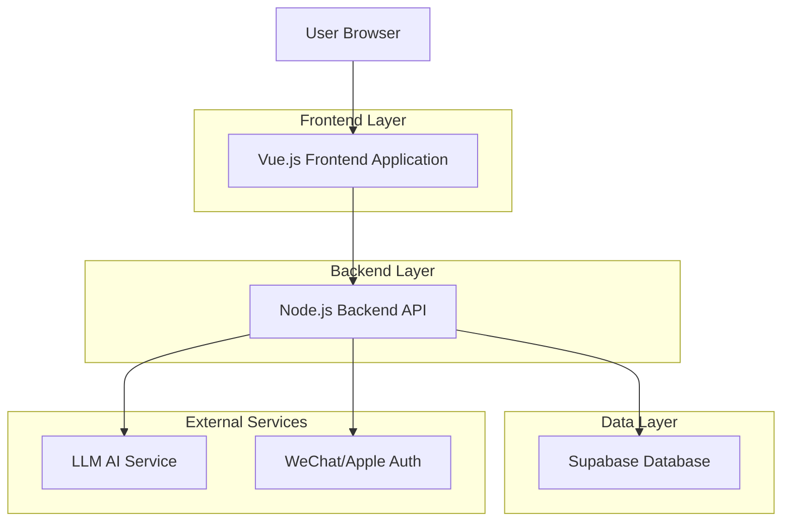
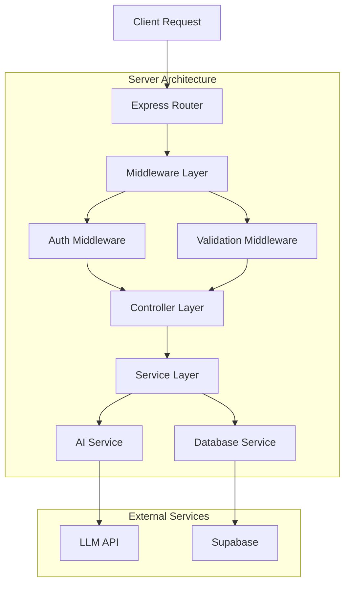
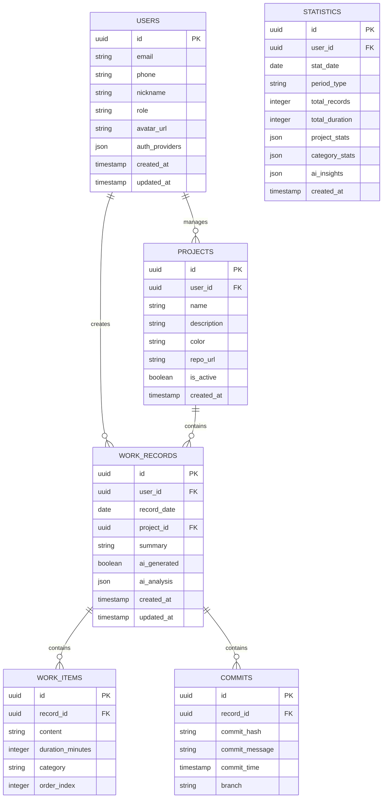

## 1. Architecture design



## 2. Technology Description
- **Frontend**: Vue.js@3 + Vite + Element Plus UI
- **Initialization Tool**: vite-init
- **Backend**: Node.js@18 + Express.js@4
- **Database**: Supabase (PostgreSQL)
- **Authentication**: Supabase Auth + JWT
- **AI Integration**: OpenAI API / 通义千问 API
- **State Management**: Pinia
- **HTTP Client**: Axios
- **Charts**: ECharts
- **Date Handling**: Day.js

## 3. Route definitions

| Route | Purpose |
|-------|---------|
| / | 登录页，用户身份选择和认证 |
| /dashboard | 今日记录页，主要工作记录入口 |
| /history | 历史记录页，查看过往工作记录 |
| /statistics | 数据统计页，可视化图表展示 |
| /projects | 项目管理页，项目创建和管理 |
| /profile | 个人中心页，用户设置和偏好 |
| /guest | 游客模式页面，本地数据记录 |

## 4. API definitions

### 4.1 Authentication APIs

**用户登录**
```
POST /api/auth/login
```

Request:
| Param Name | Param Type | isRequired | Description |
|------------|------------|------------|-------------|
| phone | string | false | 手机号（手机号登录） |
| code | string | false | 验证码（手机号登录） |
| wechat_code | string | false | 微信授权码 |
| apple_token | string | false | Apple ID token |
| guest_id | string | false | 游客模式ID |

Response:
```json
{
  "token": "jwt_token_string",
  "user": {
    "id": "user_id",
    "nickname": "用户昵称",
    "role": "programmer" | "normal",
    "avatar": "avatar_url"
  }
}
```

### 4.2 Work Record APIs

**创建工作日记录**
```
POST /api/work-records
```

Request:
| Param Name | Param Type | isRequired | Description |
|------------|------------|------------|-------------|
| date | string | true | 日期 (YYYY-MM-DD) |
| projects | array | false | 项目ID数组 |
| commits | array | false | commit记录数组 |
| work_items | array | false | 工作项数组 |
| summary | string | false | 工作总结 |
| ai_generated | boolean | false | 是否AI生成 |

**获取工作日记录**
```
GET /api/work-records/:date
```

**生成AI总结**
```
POST /api/work-records/ai-summary
```

Request:
| Param Name | Param Type | isRequired | Description |
|------------|------------|------------|-------------|
| work_data | object | true | 工作数据对象 |
| user_role | string | true | 用户角色 |

### 4.3 Statistics APIs

**获取统计数据**
```
GET /api/statistics
```

Query Parameters:
| Param Name | Param Type | isRequired | Description |
|------------|------------|------------|-------------|
| start_date | string | true | 开始日期 |
| end_date | string | true | 结束日期 |
| group_by | string | false | 分组方式 (day/week/month) |

### 4.4 Project APIs

**获取项目列表**
```
GET /api/projects
```

**创建项目**
```
POST /api/projects
```

Request:
| Param Name | Param Type | isRequired | Description |
|------------|------------|------------|-------------|
| name | string | true | 项目名称 |
| description | string | false | 项目描述 |
| color | string | false | 主题颜色 |
| repo_url | string | false | 代码仓库地址（程序员模式） |

## 5. Server architecture diagram



## 6. Data model

### 6.1 Data model definition



### 6.2 Data Definition Language

**用户表 (users)**
```sql
CREATE TABLE users (
    id UUID PRIMARY KEY DEFAULT gen_random_uuid(),
    email VARCHAR(255) UNIQUE,
    phone VARCHAR(20) UNIQUE,
    nickname VARCHAR(100) NOT NULL,
    role VARCHAR(20) DEFAULT 'normal' CHECK (role IN ('programmer', 'normal')),
    avatar_url TEXT,
    auth_providers JSONB DEFAULT '{}',
    created_at TIMESTAMP WITH TIME ZONE DEFAULT NOW(),
    updated_at TIMESTAMP WITH TIME ZONE DEFAULT NOW()
);

CREATE INDEX idx_users_email ON users(email);
CREATE INDEX idx_users_phone ON users(phone);
```

**项目表 (projects)**
```sql
CREATE TABLE projects (
    id UUID PRIMARY KEY DEFAULT gen_random_uuid(),
    user_id UUID REFERENCES users(id) ON DELETE CASCADE,
    name VARCHAR(200) NOT NULL,
    description TEXT,
    color VARCHAR(7) DEFAULT '#D4A5A5',
    repo_url TEXT,
    is_active BOOLEAN DEFAULT true,
    created_at TIMESTAMP WITH TIME ZONE DEFAULT NOW()
);

CREATE INDEX idx_projects_user_id ON projects(user_id);
CREATE INDEX idx_projects_active ON projects(is_active);
```

**工作记录表 (work_records)**
```sql
CREATE TABLE work_records (
    id UUID PRIMARY KEY DEFAULT gen_random_uuid(),
    user_id UUID REFERENCES users(id) ON DELETE CASCADE,
    record_date DATE NOT NULL,
    project_id UUID REFERENCES projects(id),
    summary TEXT,
    ai_generated BOOLEAN DEFAULT false,
    ai_analysis JSONB DEFAULT '{}',
    created_at TIMESTAMP WITH TIME ZONE DEFAULT NOW(),
    updated_at TIMESTAMP WITH TIME ZONE DEFAULT NOW(),
    UNIQUE(user_id, record_date, project_id)
);

CREATE INDEX idx_work_records_user_date ON work_records(user_id, record_date);
CREATE INDEX idx_work_records_project ON work_records(project_id);
```

**工作项表 (work_items)**
```sql
CREATE TABLE work_items (
    id UUID PRIMARY KEY DEFAULT gen_random_uuid(),
    record_id UUID REFERENCES work_records(id) ON DELETE CASCADE,
    content TEXT NOT NULL,
    duration_minutes INTEGER DEFAULT 0,
    category VARCHAR(50),
    order_index INTEGER DEFAULT 0,
    created_at TIMESTAMP WITH TIME ZONE DEFAULT NOW()
);

CREATE INDEX idx_work_items_record_id ON work_items(record_id);
```

**提交记录表 (commits)**
```sql
CREATE TABLE commits (
    id UUID PRIMARY KEY DEFAULT gen_random_uuid(),
    record_id UUID REFERENCES work_records(id) ON DELETE CASCADE,
    commit_hash VARCHAR(40) NOT NULL,
    commit_message TEXT,
    commit_time TIMESTAMP WITH TIME ZONE,
    branch VARCHAR(100),
    created_at TIMESTAMP WITH TIME ZONE DEFAULT NOW()
);

CREATE INDEX idx_commits_record_id ON commits(record_id);
CREATE INDEX idx_commits_hash ON commits(commit_hash);
```

**统计数据表 (statistics)**
```sql
CREATE TABLE statistics (
    id UUID PRIMARY KEY DEFAULT gen_random_uuid(),
    user_id UUID REFERENCES users(id) ON DELETE CASCADE,
    stat_date DATE NOT NULL,
    period_type VARCHAR(10) CHECK (period_type IN ('day', 'week', 'month', 'year')),
    total_records INTEGER DEFAULT 0,
    total_duration INTEGER DEFAULT 0,
    project_stats JSONB DEFAULT '{}',
    category_stats JSONB DEFAULT '{}',
    ai_insights JSONB DEFAULT '{}',
    created_at TIMESTAMP WITH TIME ZONE DEFAULT NOW(),
    UNIQUE(user_id, stat_date, period_type)
);

CREATE INDEX idx_statistics_user_period ON statistics(user_id, period_type, stat_date);
```

**权限设置**
```sql
-- 基础读取权限
GRANT SELECT ON ALL TABLES TO anon;

-- 认证用户完整权限
GRANT ALL PRIVILEGES ON ALL TABLES TO authenticated;

-- RLS (Row Level Security) 策略
ALTER TABLE work_records ENABLE ROW LEVEL SECURITY;
ALTER TABLE projects ENABLE ROW LEVEL SECURITY;
ALTER TABLE statistics ENABLE ROW LEVEL SECURITY;

-- 用户只能访问自己的数据
CREATE POLICY user_work_records ON work_records
    FOR ALL TO authenticated
    USING (auth.uid() = user_id);

CREATE POLICY user_projects ON projects
    FOR ALL TO authenticated
    USING (auth.uid() = user_id);

CREATE POLICY user_statistics ON statistics
    FOR ALL TO authenticated
    USING (auth.uid() = user_id);
```